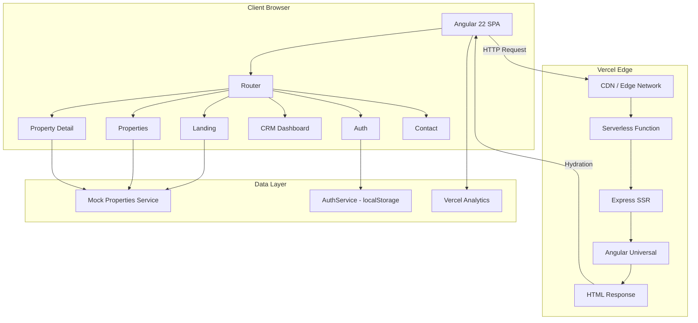
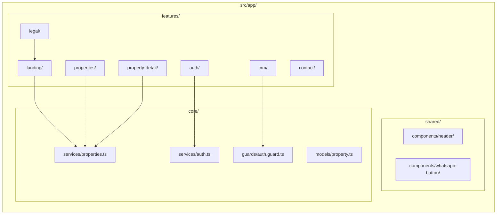
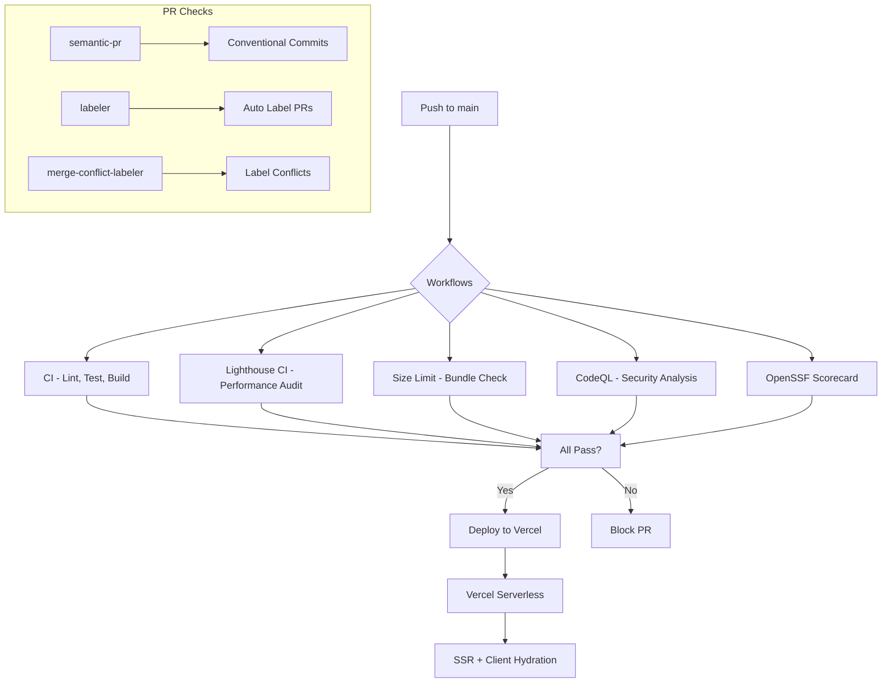
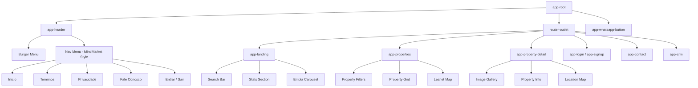

<div align="center">

# MTconnect-BR

**Plataforma imobiliária Angular 22 com SSR para compra e aluguel de imóveis em todo o Brasil.**

[](https://github.com/MTconnect-BR/meu-app/actions/workflows/ci.yml)
[](https://github.com/MTconnect-BR/meu-app/actions/workflows/lighthouse.yml)
[](https://github.com/ai/size-limit)
[](https://opensource.org/licenses/MIT)

</div>

---

## Tech Stack

| Category | Technology |
|----------|-----------|
| **Framework** | Angular 22 with SSR |
| **Monorepo** | Nx 23 |
| **Package Manager** | pnpm 11.9 |
| **Styling** | Tailwind CSS 4 |
| **UI Components** | Spartan NG Helm |
| **Maps** | Leaflet (ngx-leaflet) |
| **Carousel** | Embla Carousel |
| **Icons** | ng-icons (Lucide) |
| **Testing** | Vitest + Playwright (E2E) |
| **Analytics** | Vercel Analytics + Speed Insights |
| **Deployment** | Vercel (SSR Serverless) |

## Architecture



## Project Structure



## CI/CD Pipeline



## Component Tree



## Quick Start

### Prerequisites

- [Node.js](https://nodejs.org/) v24+
- [pnpm](https://pnpm.io/) v11.9+

### Setup

```bash
git clone https://github.com/MTconnect-BR/meu-app.git
cd meu-app
pnpm install
pnpm start
```

Open [http://localhost:4200](http://localhost:4200) in your browser.

### Available Commands

| Command | Description |
|---------|-------------|
| `pnpm start` | Start development server |
| `pnpm build` | Production build |
| `pnpm test` | Run unit tests |
| `pnpm lint` | Run ESLint |
| `pnpm format` | Format code with Prettier |
| `pnpm dead-code` | Detect dead code with Knip |
| `pnpm size-limit` | Check bundle size |
| `pnpm test:coverage` | Run tests with coverage |
| `pnpm analyze` | Analyze bundle size |

## Project Architecture

```
src/
├── app/
│   ├── core/                    # Singleton services, guards, models
│   │   ├── guards/              # Route guards (auth)
│   │   ├── models/              # TypeScript interfaces (Property)
│   │   └── services/            # Singleton services (auth, properties, theme)
│   ├── shared/                  # Reusable components
│   │   └── components/
│   │       ├── header/          # Navigation header
│   │       └── whatsapp-button/ # WhatsApp floating button
│   └── features/                # Feature modules
│       ├── landing/             # Home page with search & stats
│       ├── properties/          # Property listing with filters
│       ├── property-detail/     # Single property view
│       ├── auth/                # Login & signup
│       ├── contact/             # Contact via WhatsApp
│       ├── crm/                 # CRM dashboard (guarded)
│       └── legal/               # Terms & privacy pages
├── server.ts                    # Express SSR server with CSP
├── main.ts                      # Client bootstrap
└── main.server.ts               # Server bootstrap
```

## CI/CD Pipeline

This project uses **9 GitHub Actions workflows** for continuous integration and delivery:

| Workflow | Description |
|----------|-------------|
| `ci.yml` | Lint, test, build (Socket.dev + Codecov) |
| `lighthouse.yml` | Lighthouse CI audits (3 runs) |
| `size-limit.yml` | Bundle size checks (450 kB limit) |
| `semantic-pr.yml` | Conventional commit PR titles |
| `codeql.yml` | GitHub CodeQL security analysis |
| `scorecard.yml` | OpenSSF Scorecard security audit |
| `labeler.yml` | Auto-label PRs by file changes |
| `merge-conflict-labeler.yml` | Label PRs with conflicts |
| `dependabot-auto-merge.yml` | Auto-merge Dependabot PRs |

## Lighthouse Scores

| Metric | Score |
|--------|-------|
| Performance | 98 |
| Accessibility | 100 |
| Best Practices | 100 |
| SEO | 100 |

## Security

- **Nonce-based Content Security Policy** (CSP) per request
- **Trusted Types** for DOM injection protection
- **Security Headers**: HSTS, X-Frame-Options, X-Content-Type-Options, COOP, Permissions-Policy
- **OpenSSF Scorecard** continuous security monitoring

See [SECURITY.md](SECURITY.md) for reporting vulnerabilities.

## Contributing

We welcome contributions! Please read our [Contributing Guide](CONTRIBUTING.md) before submitting a PR.

1. Fork the repo
2. Create your feature branch (`git checkout -b feat/my-feature`)
3. Commit your changes (`git commit -m 'feat(scope): add new feature'`)
4. Push to the branch (`git push origin feat/my-feature`)
5. Open a Pull Request

See the [Code of Conduct](CODE_OF_CONDUCT.md).

## License

[MIT](LICENSE) © [Matheus Moraes](https://github.com/mmdj04)
